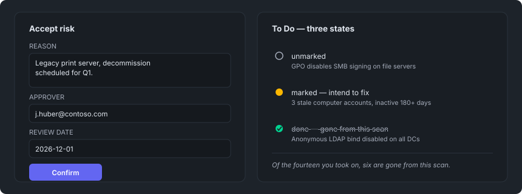

<div class="lang-en" markdown="1">

# Accepted risks and to-dos

Two lists, one mechanism, one difference that decides which you want:

- An **accepted risk** says *we have decided to live with this*. It is removed from
  the risk scores, and it needs a reason and an approver.
- A **to-do** says *we intend to fix this*. It changes no number and needs no
  approval.

Both last. Both are keyed on the check plus the object, so a later scan of the same
estate matches them against its own findings.



*Illustrative mock-up with invented findings — not a real scan.*

## Why there is a file step at all

A report is a static HTML file. **No browser lets a local page write to disk**, so
a decision made in the report cannot reach the next scan on its own. That is the
one constraint the whole round trip follows from.

## The round trip

1. **Accept** or **mark** findings in the report.
2. Press **Export**. You get one file, `itdsecscan-lists.json`, holding both lists —
   whichever tab you pressed it on.
3. Put it in `baselines\inbox\`.
4. The next scan merges it, says what changed, and moves the file to
   `baselines\inbox\merged\` so it is not merged again.

Or, without waiting for a scan:

```powershell
.\ITdSecScan.exe -import itdsecscan-lists.json
```

The importer also accepts the older single-list files, classified by their contents
rather than their name — the browser decides what a download is called, and the
second one is called `…(1).json`.

## What the merge does

Additive on both halves. Two people exporting from their own copy of the same
report do not drop each other's work.

**An import that adds an accepted risk is announced, in the console and in the
report's Info tab.** An acceptance is subtracted from the risk score of every check
it touches, so a file dropped in a directory can lower a report's numbers — and
somebody reading that report months later has to be able to tell a scoring change
that came from an import from one that came from the estate. A to-do import gets a
line and no ceremony, because it changes nothing.

## In the browser, before you export

Changes survive a reload in that browser. They are **not** on the store until the
file goes back — the browser is a working layer, not storage. Hand the file on and
the recipient's browser starts from what the report was published with, plus
whatever they do themselves.

The **Accepted Risks** tab lists what you accept here under **Not yet exported**,
separate from what is on file, and strikes through an entry you reopened. The two
groups answer different questions — what the store holds, and what this browser
holds — and only the first survives being handed on.

## A rescan tells you what happened to the list

The report matches your to-dos against its own findings and reports the ones it can
no longer find: *"of the fourteen you took on, six are gone."* That is the only
progress report the tool gives on your own remediation work.

The wording is **"gone from this scan"**, not "fixed", because the two are not the
same: a check that could not run reports nothing, and a finding whose identity
changed appears as a new one. The tool reports what it observed and you confirm it.
Your confirmation is carried into the export, even though such an entry has no row
left in the report.

**A finished to-do is kept, never deleted.** It is the record of what was handled;
removing it would leave a later scan unable to tell a finding somebody fixed from
one nobody ever looked at.

## Where the files live

```
baselines\whitelist.json     accepted risks
baselines\todos.json         to-dos
baselines\inbox\             drop exported files here
baselines\inbox\merged\      what has been applied, timestamped
```

Two files in the store, one file in transit: the export holds both lists together
so there is a single file to hand on, while the store keeps them apart — an
accepted risk is a decision record with a reason, an approver and a review date,
and a to-do is working state.

Both sit at the root of the store and are shared by the AD and Entra checks, since
one report can cover both. With `-profile`, each profile has its own set —
sharing acceptances between two tenants would suppress findings in the wrong one.

Baselines on disk hold every finding, accepted or not. Acceptance is applied when a
report is rendered or two snapshots are compared, and to **both** sides of a
comparison — so an acceptance made between two scans does not appear as drift.

</div>

<div class="lang-de" markdown="1">

# Accepted Risks und To-Dos

Zwei Listen, ein Mechanismus, ein Unterschied, der entscheidet, welche gemeint ist:

- Ein **Accepted Risk** sagt *wir haben entschieden, damit zu leben*. Er wird aus
  den Risk Scores herausgerechnet und braucht eine Begründung und einen Genehmiger.
- Ein **To-Do** sagt *wir haben vor, das zu beheben*. Es ändert keine Zahl und
  braucht keine Genehmigung.

Beide bleiben bestehen. Beide sind über Check plus Objekt eindeutig zugeordnet,
sodass ein späterer Scan desselben Bestands sie gegen seine eigenen Funde
abgleicht.


*Illustratives Mock-up mit erfundenen Funden — kein echter Scan.*

## Warum es überhaupt einen Dateischritt braucht

Ein Report ist eine statische HTML-Datei. **Kein Browser lässt eine lokale Seite
auf die Festplatte schreiben**, also kann eine im Report getroffene Entscheidung
nicht von selbst zum nächsten Scan gelangen. Das ist die eine Einschränkung, aus
der der gesamte Rundlauf folgt.

## Der Rundlauf

1. Funde im Report **akzeptieren** oder **markieren**.
2. **Export** drücken. Man erhält eine Datei, `itdsecscan-lists.json`, mit beiden
   Listen — unabhängig davon, auf welchem Tab man gedrückt hat.
3. In `baselines\inbox\` ablegen.
4. Der nächste Scan führt sie zusammen, meldet, was sich geändert hat, und
   verschiebt die Datei nach `baselines\inbox\merged\`, damit sie nicht erneut
   zusammengeführt wird.

Oder, ohne auf einen Scan zu warten:

```powershell
.\ITdSecScan.exe -import itdsecscan-lists.json
```

Der Import akzeptiert auch die älteren Einzellisten-Dateien, klassifiziert anhand
ihres Inhalts statt ihres Namens — der Browser entscheidet, wie ein Download
heißt, und die zweite Datei heißt `…(1).json`.

## Was der Merge macht

Additiv auf beiden Hälften. Zwei Personen, die aus ihrer eigenen Kopie desselben
Reports exportieren, verlieren nicht gegenseitig ihre Arbeit.

**Ein Import, der einen Accepted Risk hinzufügt, wird angekündigt — in der Konsole
und im Info-Tab des Reports.** Eine Akzeptanz wird vom Risk Score jedes Checks
abgezogen, den sie betrifft, sodass eine in ein Verzeichnis abgelegte Datei die
Zahlen eines Reports senken kann — und jemand, der diesen Report Monate später
liest, muss eine Score-Änderung durch einen Import von einer durch den Bestand
selbst unterscheiden können. Ein To-Do-Import bekommt eine Zeile und keine
Zeremonie, weil er nichts ändert.

## Im Browser, vor dem Export

Änderungen überstehen einen Reload in diesem Browser. Sie sind **nicht** im
Speicher, bis die Datei zurückkommt — der Browser ist eine Arbeitsebene, kein
Speicher. Die Datei weitergeben, und der Browser der empfangenden Person startet
mit dem, womit der Report veröffentlicht wurde, plus allem, was sie selbst
hinzufügt.

Der **Accepted Risks**-Tab listet, was Sie hier akzeptieren, unter **Not yet
exported** — getrennt von dem, was auf der Platte liegt — und streicht einen
Eintrag durch, den Sie wieder geöffnet haben. Die beiden Gruppen beantworten
verschiedene Fragen: was der Speicher enthält, und was dieser Browser enthält.
Nur das Erste übersteht das Weitergeben.

## Ein erneuter Scan sagt, was mit der Liste passiert ist

Der Report gleicht die To-Dos gegen seine eigenen Funde ab und meldet jene, die er
nicht mehr findet: *"of the fourteen you took on, six are gone."* Das ist der
einzige Fortschrittsbericht, den das Tool zur eigenen Abhilfearbeit gibt.

Die Formulierung lautet **"gone from this scan"**, nicht "fixed", weil beides
nicht dasselbe ist: Ein Check, der nicht laufen konnte, meldet nichts, und ein
Fund, dessen Identität sich geändert hat, erscheint als neu. Das Tool meldet, was
es beobachtet hat, und man bestätigt es selbst. Diese Bestätigung wird in den
Export übernommen, auch wenn ein solcher Eintrag keine Zeile mehr im Report hat.

**Ein erledigtes To-Do bleibt erhalten, wird nie gelöscht.** Es ist der Nachweis,
was bearbeitet wurde; würde man es entfernen, könnte ein späterer Scan nicht mehr
unterscheiden zwischen einem Fund, den jemand behoben hat, und einem, den nie
jemand angesehen hat.

## Wo die Dateien liegen

```
baselines\whitelist.json     Accepted Risks
baselines\todos.json         To-Dos
baselines\inbox\             exportierte Dateien hier ablegen
baselines\inbox\merged\      bereits Angewendetes, mit Zeitstempel
```

Zwei Dateien im Speicher, eine Datei unterwegs: Der Export hält beide Listen
zusammen, sodass es eine einzelne Datei zum Weitergeben gibt, während der
Speicher sie getrennt hält — ein Accepted Risk ist ein Entscheidungsprotokoll mit
Begründung, Genehmiger und Überprüfungsdatum, und ein To-Do ist Arbeitszustand.

Beide liegen an der Wurzel des Speichers und werden von den AD- und
Entra-Checks gemeinsam genutzt, da ein Report beide abdecken kann. Mit
`-profile` hat jedes Profil seinen eigenen Satz — würden sich zwei Tenants
Akzeptanzen teilen, würden Funde im falschen unterdrückt.

Baselines auf der Festplatte enthalten jeden Fund, akzeptiert oder nicht. Die
Akzeptanz wird angewendet, wenn ein Report gerendert oder zwei Momentaufnahmen
verglichen werden — und zwar auf **beiden** Seiten eines Vergleichs, sodass eine
zwischen zwei Scans getroffene Akzeptanz nicht als Drift erscheint.

</div>
