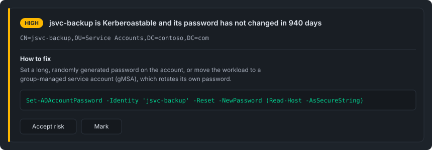
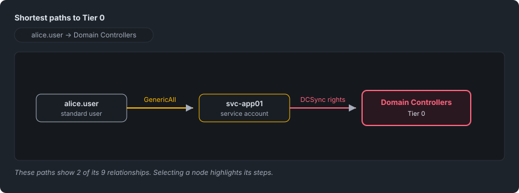

# Reading the report

One self-contained HTML file. No external assets, no internet, no server — it works
from a share, an attachment or a USB stick. It prints, and printing reveals every
tab, because a PDF of one open tab is a PDF of a fragment.

## The tabs

| Tab | What it answers |
|---|---|
| **Overview** | The risk score, the worst findings, and what the scan could and could not see. |
| **Active Directory** / **Entra ID** | The findings, per check. Separate tabs with separate filter bars. |
| **Attack Paths** | Routes from an ordinary principal to control of the directory or tenant. |
| **To Do** | What you have taken on. |
| **Changes** | Comparison reports only. |
| **Accepted Risks** | What you have decided to live with, with reason and approver. |
| **Info** | Which account, which tenant, which permissions — the access the findings were gathered with. |

**Read Info first on a report you did not run yourself.** A clean Entra section
gathered by an app registration missing half its consent looks exactly like a clean
tenant, and this is the tab that tells the two apart.

## Filtering

Each estate has its own filter bar: severity, and a text search over the findings.

Filtering never expands a collapsed group. A group that stays collapsed shows how
many of its findings match the current filter, as "3 of 12".

## A finding

*Illustrative mock-up with an invented finding — not a real scan.*

Each row identifies an object and carries a severity. Under the finding text:

- **How to fix** — the guidance, collapsed. Where a fix can break something it names
  the audit step that lists what will break, before the change.
- **A PowerShell one-liner**, where the fix is a single command. The object's own
  identity is already substituted into it, so it can be copied and run as it
  stands. Not every finding has one: constrained delegation, for example, requires
  a decision about which targets to allow, which the tool cannot make for you.
- **Accept risk** and **Mark** — see [accepted risks and to-dos](accepted-risks-and-todos.md).

## Attack paths

*Illustrative mock-up with an invented path — not a real scan.*

The tab offers a set of questions ("shortest paths to Tier 0", "paths through a
service account"), each with the number of paths it matches. Questions with no
matching path in this report are not listed.

Pick one and the graph draws it. Click a node to highlight its steps and dim the
explanations that do not concern it.

**Two limits, both stated on the page rather than left to be inferred:**

- A query shows **at most three routes per principal**. Selecting a node states how
  many of its relationships the drawn paths cover, as "these paths show 3 of its 36
  relationships".
- The graph is built from the findings the checks reported, and a check that caps
  its finding list caps the graph with it. A path can therefore be **absent** from
  the report while existing in the directory. No path is shown that the findings do
  not support.

## Look up an object

Below the graph: type any user, computer or group the scan saw and read what
controls it and what it controls, then follow a relationship to the next object.

This is not limited to the paths above: a relationship that does not end at Tier 0
is not a path, and is still worth knowing about.

For **delegated rights the lists are complete**, not a sample. They are built from
every object each reported delegation reaches, which is a far larger set than the
paths above draw — a single delegation inherited from the domain root can reach
thousands of objects.

Because it can be that large, each list **shows the 200 worst entries** — Tier 0
first — and states the full number beside them. The count is the complete one;
only the rows are cut.

Two things it does not cover, and says so where the list is empty:

- **Group membership is only enumerated for privileged groups.** A member of an
  ordinary group does not appear.
- A **Tier 0** principal usually shows no outbound relationships. Its control of
  the directory is by design and is not reported as a finding, so the interesting
  half for such an object is the inbound list.

## Layout

Wide tables scroll in their own box, so the page itself never scrolls sideways and
the tab bar and filter stay in place. Over-long values are
truncated rather than hidden behind a disclosure — the full value is in the check's
CSV export. The theme follows your system setting until you choose, and the choice
persists per browser.

# Den Report lesen

Eine einzelne, in sich geschlossene HTML-Datei. Keine externen Assets, kein
Internet, kein Server — sie funktioniert von einer Freigabe, einem E-Mail-Anhang
oder einem USB-Stick aus. Sie druckt sich, und beim Drucken erscheinen alle Tabs,
denn ein PDF von nur einem offenen Tab wäre ein PDF eines Fragments.

## Die Tabs

| Tab | Worauf er antwortet |
|---|---|
| **Overview** | Der Risk Score, die schwerwiegendsten Funde, und was der Scan sehen konnte und was nicht. |
| **Active Directory** / **Entra ID** | Die Funde, je Check. Getrennte Tabs mit getrennten Filterleisten. |
| **Attack Paths** | Wege von einem gewöhnlichen Principal bis zur Kontrolle über das Verzeichnis oder den Tenant. |
| **To Do** | Was Sie sich vorgenommen haben. |
| **Changes** | Nur bei Vergleichsreports. |
| **Accepted Risks** | Was Sie zu akzeptieren entschieden haben, mit Begründung und Genehmiger. |
| **Info** | Welches Konto, welcher Tenant, welche Berechtigungen — der Zugriff, mit dem die Funde erhoben wurden. |

**Bei einem Report, den Sie nicht selbst ausgeführt haben, zuerst Info lesen.**
Ein sauberer Entra-Abschnitt, erhoben mit einer App-Registrierung, der die Hälfte
ihrer Consents fehlt, sieht exakt wie ein sauberer Tenant aus — und dieser Tab ist
es, der die beiden unterscheidet.

## Filtern

Jeder Bestand hat seine eigene Filterleiste: Schweregrad und eine Textsuche über
die Funde.

Filtern klappt nie eine eingeklappte Gruppe auf. Eine eingeklappt bleibende Gruppe
zeigt, wie viele ihrer Funde zum aktuellen Filter passen, etwa als „3 von 12“.

## Ein Fund

*Illustratives Mock-up mit einem erfundenen Fund — kein echter Scan.*

Jede Zeile identifiziert ein Objekt und trägt einen Schweregrad. Unter dem Fundtext:

- **How to fix** — die Anleitung, eingeklappt. Wo eine Abhilfe etwas beschädigen
  kann, nennt sie vor der Änderung den Audit-Schritt, der auflistet, was betroffen
  wäre.
- **Ein PowerShell-Einzeiler**, wo die Abhilfe ein einzelner Befehl ist. Die
  Identität des Objekts ist bereits eingesetzt, sodass er unverändert kopiert und
  ausgeführt werden kann. Nicht jeder Fund hat einen: eingeschränkte Delegation
  zum Beispiel erfordert eine Entscheidung, welche Ziele erlaubt werden sollen —
  eine Entscheidung, die das Tool nicht für Sie treffen kann.
- **Accept risk** und **Mark** — siehe [Accepted Risks und To-Dos](accepted-risks-and-todos.md).

## Attack Paths

*Illustratives Mock-up mit einem erfundenen Pfad — kein echter Scan.*

Der Tab bietet eine Reihe von Fragen an ("shortest paths to Tier 0", "paths
through a service account"), jede mit der Anzahl der passenden Pfade. Fragen ohne
passenden Pfad in diesem Report werden nicht aufgelistet.

Eine auswählen, und der Graph zeichnet sie. Ein Klick auf einen Knoten hebt dessen
Schritte hervor und blendet die Erklärungen ab, die ihn nicht betreffen.

**Zwei Grenzen, beide auf der Seite genannt statt dem Erraten überlassen:**

- Eine Abfrage zeigt **höchstens drei Routen pro Principal**. Die Auswahl eines
  Knotens gibt an, wie viele seiner Beziehungen die gezeichneten Pfade abdecken,
  etwa als „these paths show 3 of its 36 relationships“.
- Der Graph wird aus den von den Checks gemeldeten Funden gebaut, und ein Check,
  der seine Fundliste begrenzt, begrenzt damit auch den Graphen. Ein Pfad kann
  daher im Report **fehlen**, obwohl er im Verzeichnis existiert. Es wird kein
  Pfad gezeigt, den die Funde nicht stützen.

## Ein Objekt nachschlagen

Unter dem Graphen: einen beliebigen vom Scan gesehenen Benutzer, Computer oder
eine Gruppe eingeben und lesen, was ihn kontrolliert und was er kontrolliert, dann
einer Beziehung zum nächsten Objekt folgen.

Das ist nicht auf die obigen Pfade beschränkt: Eine Beziehung, die nicht bei
Tier 0 endet, ist kein Pfad — aber trotzdem wissenswert.

Bei **delegierten Rechten sind die Listen vollständig**, keine Stichprobe. Sie
werden aus jedem Objekt gebaut, das eine gemeldete Delegation erreicht — eine weit
größere Menge, als die obigen Pfade zeichnen: Eine einzelne, von der Domänenwurzel
geerbte Delegation kann Tausende Objekte erreichen.

Weil sie so groß werden kann, zeigt jede Liste **die 200 schwerwiegendsten
Einträge** — Tier 0 zuerst — und nennt die vollständige Anzahl daneben. Die Zahl
ist die vollständige; nur die Zeilen sind gekappt.

Zwei Dinge deckt sie nicht ab, und sagt das dort, wo die Liste leer ist:

- **Gruppenmitgliedschaft wird nur für privilegierte Gruppen erfasst.** Ein
  Mitglied einer gewöhnlichen Gruppe erscheint nicht.
- Ein **Tier-0**-Principal zeigt meist keine ausgehenden Beziehungen. Seine
  Kontrolle über das Verzeichnis ist beabsichtigt und wird nicht als Fund
  gemeldet — der interessante Teil ist bei einem solchen Objekt also die
  eingehende Liste.

## Layout

Breite Tabellen scrollen in ihrer eigenen Box, sodass die Seite selbst nie seitlich
scrollt und Tab-Leiste und Filter an Ort und Stelle bleiben. Zu lange Werte werden
abgeschnitten statt hinter einer Ausklapp-Funktion versteckt — der vollständige
Wert steht im CSV-Export des Checks. Das Theme folgt der Systemeinstellung, bis
Sie selbst wählen, und die Wahl bleibt pro Browser erhalten.

