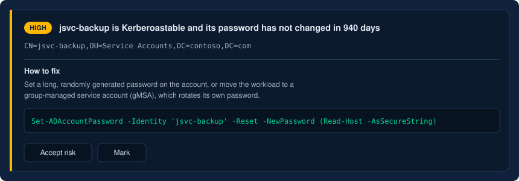
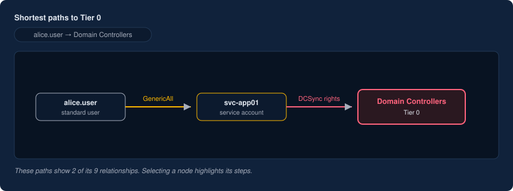

<div class="lang-en" markdown="1">

# Reading the report

One self-contained HTML file. No external assets, no internet, no server — it works
from a share, an attachment or a USB stick. It prints, and printing reveals every
tab, because a PDF of one open tab is a PDF of a fragment.

## The tabs

| Tab | What it answers |
|---|---|
| **Overview** | The risk score, the worst findings, and what the scan could and could not see. |
| **Active Directory** / **Entra ID** | The findings, per check. Separate tabs with separate filter bars. |
| **Attack Paths** | Routes from an ordinary principal to control of the directory or tenant. |
| **To Do** | What you have taken on. |
| **Changes** | Comparison reports only. |
| **Accepted Risks** | What you have decided to live with, with reason and approver. |
| **Info** | Which account, which tenant, which permissions — the access the findings were gathered with. |

**Read Info first on a report you did not run yourself.** A clean Entra section
gathered by an app registration missing half its consent looks exactly like a clean
tenant, and this is the tab that tells the two apart.

## Filtering

Each estate has its own filter bar: severity, and a text search over the findings.

Filtering never expands a collapsed group. A group that stays collapsed shows how
many of its findings match the current filter, as "3 of 12".

## A finding



*Illustrative mock-up with an invented finding — not a real scan.*

Each row identifies an object and carries a severity. Under the finding text:

- **How to fix** — the guidance, collapsed. Where a fix can break something it names
  the audit step that lists what will break, before the change.
- **A PowerShell one-liner**, where the fix is a single command. The object's own
  identity is already substituted into it, so it can be copied and run as it
  stands. Not every finding has one: constrained delegation, for example, requires
  a decision about which targets to allow, which the tool cannot make for you.
- **Accept risk** and **Mark** — see [accepted risks and to-dos](accepted-risks-and-todos.md).

## Attack paths



*Illustrative mock-up with an invented path — not a real scan.*

The tab offers a set of questions ("shortest paths to Tier 0", "paths through a
service account"), each with the number of paths it matches. Questions with no
matching path in this report are not listed.

Pick one and the graph draws it. Click a node to highlight its steps and dim the
explanations that do not concern it.

**Two limits, both stated on the page rather than left to be inferred:**

- A query shows **at most three routes per principal**. Selecting a node states how
  many of its relationships the drawn paths cover, as "these paths show 3 of its 36
  relationships".
- The graph is built from the findings the checks reported, and a check that caps
  its finding list caps the graph with it. A path can therefore be **absent** from
  the report while existing in the directory. No path is shown that the findings do
  not support.

## Look up an object

Below the graph: type any user, computer or group the scan saw and read what
controls it and what it controls, then follow a relationship to the next object.

This is not limited to the paths above: a relationship that does not end at Tier 0
is not a path, and is still worth knowing about.

For **delegated rights the lists are complete**, not a sample. They are built from
every object each reported delegation reaches, which is a far larger set than the
paths above draw — a single delegation inherited from the domain root can reach
thousands of objects.

Because it can be that large, each list **shows the 200 worst entries** — Tier 0
first — and states the full number beside them. The count is the complete one;
only the rows are cut.

Two things it does not cover, and says so where the list is empty:

- **Group membership is only enumerated for privileged groups.** A member of an
  ordinary group does not appear.
- A **Tier 0** principal usually shows no outbound relationships. Its control of
  the directory is by design and is not reported as a finding, so the interesting
  half for such an object is the inbound list.

## The risk score

Every open finding counts by severity — critical 10 points, high 4, medium 1,
low 0.1 — and a score places the total on a 0–100 scale:
**score = 100 · P / (P + K)**. For a single check K is 20 (two critical findings
score 50); for the whole scan K is 5,000. Accepted risks and checks that could not
run add nothing, and 0 means nothing is open.

The score therefore falls when findings are closed, in proportion to what was
closed — but a bounded scale can never move by more than the share of exposure
removed, and moves least where most is open. Closing 10 % of the exposure lowers a
score of 50 by about 2.5 points. That is why comparison reports also state the
**exposure change in percent** and the counts of resolved and new findings: those
are the direct measure of progress, the score is the scale it sits on.

Reports saved by an older version are re-scored on this model when they are loaded
or re-rendered, so two scans are always compared on the same scale.

## The customer in the heading

Every report — the full report, the management summary, the drift overview, the
user security and password checks — names the customer in its heading. Set it once
per configuration:

```
CUSTOMER_NAME=Contoso GmbH
```

in `ITdSecScan.config` (or in each `ITdSecScan.<profile>.config`), or pass
`-customer "Contoso GmbH"` for one run; the flag wins over the config. The name is
stored in the report's `.json`, so `-render` keeps it, and `-render … -customer`
replaces it. Without a name the heading shows the scanned domain. Every other key
of the file is in the [configuration reference](../reference/config.md).

## The management summary

`-mgmt-report` writes a print-ready summary for management — a CISO or a managing
director, not the administrator who fixes the findings. It is in **German by
default**; `-lang en` writes it in English. It works with every run that writes a
report, and it **looks the same with or without a comparison**: a comparison adds
what changed, it does not switch to a different report.

1. **The verdict** — one line from the counts: action required while critical
   findings are open, needs improvement while high ones are. It does not follow the
   score, which saturates: a domain with a hundred critical findings can score 35.
   With a comparison, one more sentence says how exposure moved and how many
   critical and high findings were resolved and added.
2. **Four figures** — critical and high findings open, checks without findings, and
   the risk score; with a comparison, each with its change.
3. **Needs attention now** — attack paths that lead to control of the domain or the
   tenant, and blind spots: checks that could not run, Graph permissions the
   scanning app lacks. With a comparison also accounts re-enabled, new critical
   findings, high-priority Group Policy changes, and disabled accounts that
   disappeared without a trace.
4. **What changed** (comparison only) — how many checks improved, got worse or
   stayed the same, and which improved and got worse most.
5. **Where the risk is** — the share of open exposure per area, each area described
   by what an attacker gains there.
6. **What is in good shape** — areas with no critical or high findings in which
   every check ran. An area with a check that could not run is never listed here.
7. **Risk decisions and work in progress** — accepted risks and the to-do list,
   when there are any.
8. **Biggest risks — recommended next steps** — decisions first (re-enabled
   accounts), then the checks holding the most exposure, each with why it matters
   and a due date.
9. **About this report** — where the details are, what could not be looked at, and
   how the score works.

The summary carries no per-check table. Every finding, the objects it affects and
the exact fix are in the full HTML report of the same run. Accepted risks are
excluded from every count, as in the full report.

### As PDF

`-pdf` saves the management summary as a PDF beside the HTML, and implies
`-mgmt-report`. It prints the same page with Microsoft Edge or Google Chrome in
headless mode, so the PDF and the HTML never differ. Windows 10 and 11 and
Windows Server 2025 ship Edge; Server 2019 and 2022 do not. Without a browser the
run stops with an error after writing the HTML, and names the way out: copy the
report's `.json` to a workstation and run `ITdSecScan.exe -render <file> -pdf`
there.

## Layout

Wide tables scroll in their own box, so the page itself never scrolls sideways and
the tab bar and filter stay in place. Over-long values are
truncated rather than hidden behind a disclosure — the full value is in the check's
CSV export. The theme follows your system setting until you choose, and the choice
persists per browser.

</div>

<div class="lang-de" markdown="1">

# Den Report lesen

Eine einzelne, in sich geschlossene HTML-Datei. Keine externen Assets, kein
Internet, kein Server — sie funktioniert von einer Freigabe, einem E-Mail-Anhang
oder einem USB-Stick aus. Sie druckt sich, und beim Drucken erscheinen alle Tabs,
denn ein PDF von nur einem offenen Tab wäre ein PDF eines Fragments.

## Die Tabs

| Tab | Worauf er antwortet |
|---|---|
| **Overview** | Der Risk Score, die schwerwiegendsten Funde, und was der Scan sehen konnte und was nicht. |
| **Active Directory** / **Entra ID** | Die Funde, je Check. Getrennte Tabs mit getrennten Filterleisten. |
| **Attack Paths** | Wege von einem gewöhnlichen Principal bis zur Kontrolle über das Verzeichnis oder den Tenant. |
| **To Do** | Was Sie sich vorgenommen haben. |
| **Changes** | Nur bei Vergleichsreports. |
| **Accepted Risks** | Was Sie zu akzeptieren entschieden haben, mit Begründung und Genehmiger. |
| **Info** | Welches Konto, welcher Tenant, welche Berechtigungen — der Zugriff, mit dem die Funde erhoben wurden. |

**Bei einem Report, den Sie nicht selbst ausgeführt haben, zuerst Info lesen.**
Ein sauberer Entra-Abschnitt, erhoben mit einer App-Registrierung, der die Hälfte
ihrer Consents fehlt, sieht exakt wie ein sauberer Tenant aus — und dieser Tab ist
es, der die beiden unterscheidet.

## Filtern

Jeder Bestand hat seine eigene Filterleiste: Schweregrad und eine Textsuche über
die Funde.

Filtern klappt nie eine eingeklappte Gruppe auf. Eine eingeklappt bleibende Gruppe
zeigt, wie viele ihrer Funde zum aktuellen Filter passen, etwa als „3 von 12“.

## Ein Fund


*Illustratives Mock-up mit einem erfundenen Fund — kein echter Scan.*

Jede Zeile identifiziert ein Objekt und trägt einen Schweregrad. Unter dem Fundtext:

- **How to fix** — die Anleitung, eingeklappt. Wo eine Abhilfe etwas beschädigen
  kann, nennt sie vor der Änderung den Audit-Schritt, der auflistet, was betroffen
  wäre.
- **Ein PowerShell-Einzeiler**, wo die Abhilfe ein einzelner Befehl ist. Die
  Identität des Objekts ist bereits eingesetzt, sodass er unverändert kopiert und
  ausgeführt werden kann. Nicht jeder Fund hat einen: eingeschränkte Delegation
  zum Beispiel erfordert eine Entscheidung, welche Ziele erlaubt werden sollen —
  eine Entscheidung, die das Tool nicht für Sie treffen kann.
- **Accept risk** und **Mark** — siehe [Accepted Risks und To-Dos](accepted-risks-and-todos.md).

## Attack Paths


*Illustratives Mock-up mit einem erfundenen Pfad — kein echter Scan.*

Der Tab bietet eine Reihe von Fragen an ("shortest paths to Tier 0", "paths
through a service account"), jede mit der Anzahl der passenden Pfade. Fragen ohne
passenden Pfad in diesem Report werden nicht aufgelistet.

Eine auswählen, und der Graph zeichnet sie. Ein Klick auf einen Knoten hebt dessen
Schritte hervor und blendet die Erklärungen ab, die ihn nicht betreffen.

**Zwei Grenzen, beide auf der Seite genannt statt dem Erraten überlassen:**

- Eine Abfrage zeigt **höchstens drei Routen pro Principal**. Die Auswahl eines
  Knotens gibt an, wie viele seiner Beziehungen die gezeichneten Pfade abdecken,
  etwa als „these paths show 3 of its 36 relationships“.
- Der Graph wird aus den von den Checks gemeldeten Funden gebaut, und ein Check,
  der seine Fundliste begrenzt, begrenzt damit auch den Graphen. Ein Pfad kann
  daher im Report **fehlen**, obwohl er im Verzeichnis existiert. Es wird kein
  Pfad gezeigt, den die Funde nicht stützen.

## Ein Objekt nachschlagen

Unter dem Graphen: einen beliebigen vom Scan gesehenen Benutzer, Computer oder
eine Gruppe eingeben und lesen, was ihn kontrolliert und was er kontrolliert, dann
einer Beziehung zum nächsten Objekt folgen.

Das ist nicht auf die obigen Pfade beschränkt: Eine Beziehung, die nicht bei
Tier 0 endet, ist kein Pfad — aber trotzdem wissenswert.

Bei **delegierten Rechten sind die Listen vollständig**, keine Stichprobe. Sie
werden aus jedem Objekt gebaut, das eine gemeldete Delegation erreicht — eine weit
größere Menge, als die obigen Pfade zeichnen: Eine einzelne, von der Domänenwurzel
geerbte Delegation kann Tausende Objekte erreichen.

Weil sie so groß werden kann, zeigt jede Liste **die 200 schwerwiegendsten
Einträge** — Tier 0 zuerst — und nennt die vollständige Anzahl daneben. Die Zahl
ist die vollständige; nur die Zeilen sind gekappt.

Zwei Dinge deckt sie nicht ab, und sagt das dort, wo die Liste leer ist:

- **Gruppenmitgliedschaft wird nur für privilegierte Gruppen erfasst.** Ein
  Mitglied einer gewöhnlichen Gruppe erscheint nicht.
- Ein **Tier-0**-Principal zeigt meist keine ausgehenden Beziehungen. Seine
  Kontrolle über das Verzeichnis ist beabsichtigt und wird nicht als Fund
  gemeldet — der interessante Teil ist bei einem solchen Objekt also die
  eingehende Liste.

## Der Risk Score

Jeder offene Fund zählt nach Schweregrad — kritisch 10 Punkte, high 4, medium 1,
low 0,1 — und ein Score bildet die Summe auf eine Skala von 0–100 ab:
**Score = 100 · P / (P + K)**. Für einen einzelnen Check ist K 20 (zwei kritische
Funde ergeben 50), für den ganzen Scan 5.000. Akzeptierte Risiken und Checks, die
nicht laufen konnten, zählen nicht; 0 heißt, nichts ist offen.

Der Score sinkt also, wenn Funde behoben werden, im Verhältnis zu dem, was behoben
wurde — aber eine begrenzte Skala kann sich nie stärker bewegen als der Anteil der
entfernten Exposition, und sie bewegt sich dort am wenigsten, wo am meisten offen
ist. Wer 10 % der Exposition schließt, senkt einen Score von 50 um etwa 2,5 Punkte.
Deshalb nennen Vergleichsreports zusätzlich die **Veränderung der Exposition in
Prozent** und die Zahl der behobenen und neuen Funde: Sie sind das direkte Maß für
Fortschritt, der Score ist die Skala, auf der er steht.

Reports einer älteren Version werden beim Laden oder Neu-Rendern auf dieses Modell
umgerechnet, damit zwei Scans immer auf derselben Skala verglichen werden.

## Der Kunde in der Überschrift

Jeder Report — der vollständige Report, die Management Summary, die Drift-Übersicht,
der User-Security- und der Passwort-Check — nennt den Kunden in der Überschrift.
Einmal je Konfiguration setzen:

```
CUSTOMER_NAME=Contoso GmbH
```

in `ITdSecScan.config` (oder in jeder `ITdSecScan.<Profil>.config`), oder für einen
Lauf `-customer "Contoso GmbH"` übergeben; der Parameter hat Vorrang vor der
Konfiguration. Der Name wird in der `.json` des Reports gespeichert, sodass
`-render` ihn behält und `-render … -customer` ihn ersetzt. Ohne Namen zeigt die
Überschrift die gescannte Domäne. Alle anderen Schlüssel der Datei stehen in der
[Referenz der Konfigurationsdatei](../reference/config.md).

## Die Management Summary

`-mgmt-report` schreibt eine druckfertige Zusammenfassung für das Management — für
CISO oder Geschäftsführung, nicht für den Administrator, der die Funde behebt. Sie
ist **standardmäßig deutsch**; `-lang en` schreibt sie auf Englisch. Sie funktioniert
mit jedem Lauf, der einen Report schreibt, und **sieht mit und ohne Vergleich gleich
aus**: Ein Vergleich ergänzt, was sich geändert hat, er wechselt nicht zu einem
anderen Bericht.

1. **Das Urteil** — eine Zeile aus den Zahlen: Handlungsbedarf, solange kritische
   Funde offen sind, Verbesserungsbedarf, solange hohe Funde offen sind. Es folgt
   nicht dem Score, der sättigt: Eine Domäne mit hundert kritischen Funden kann bei
   35 liegen. Mit Vergleich sagt ein weiterer Satz, wie sich die Exposition bewegt
   hat und wie viele kritische und hohe Funde behoben und neu sind.
2. **Vier Kennzahlen** — offene kritische und hohe Funde, Checks ohne Befund und der
   Risk Score; mit Vergleich jeweils mit ihrer Veränderung.
3. **Sofortiger Handlungsbedarf** — Angriffspfade, die zur Kontrolle über Domäne
   oder Tenant führen, und blinde Flecken: Checks, die nicht laufen konnten,
   Graph-Berechtigungen, die der scannenden App fehlen. Mit Vergleich außerdem
   wieder aktivierte Konten, neue kritische Funde, Gruppenrichtlinien-Änderungen
   hoher Priorität und deaktivierte Konten, die spurlos verschwunden sind.
4. **Was sich geändert hat** (nur mit Vergleich) — wie viele Checks besser,
   schlechter oder gleich geblieben sind, und welche sich am stärksten verbessert
   und verschlechtert haben.
5. **Wo das Risiko liegt** — der Anteil der offenen Exposition je Bereich, jeder
   Bereich beschrieben danach, was ein Angreifer dort gewinnt.
6. **Was in gutem Zustand ist** — Bereiche ohne kritische oder hohe Funde, in denen
   jeder Check gelaufen ist. Ein Bereich mit einem Check, der nicht laufen konnte,
   steht nie hier.
7. **Risikoentscheidungen und laufende Arbeit** — akzeptierte Risiken und die
   To-do-Liste, sofern vorhanden.
8. **Größte Risiken — empfohlene nächste Schritte** — zuerst Entscheidungen (wieder
   aktivierte Konten), dann die Checks mit der größten Exposition, jeweils mit
   Begründung und Frist.
9. **Zu diesem Bericht** — wo die Details stehen, was nicht geprüft werden konnte
   und wie der Score funktioniert.

Die Zusammenfassung enthält keine Tabelle je Check. Jeder Befund, die betroffenen
Objekte und die genaue Behebung stehen im vollständigen HTML-Report desselben
Laufs. Akzeptierte Risiken sind wie im vollständigen Report aus jeder Zahl
herausgerechnet.

### Als PDF

`-pdf` speichert die Management-Zusammenfassung als PDF neben dem HTML und schließt
`-mgmt-report` ein. Es druckt dieselbe Seite mit Microsoft Edge oder Google Chrome im
Headless-Modus, sodass PDF und HTML nie voneinander abweichen. Windows 10 und 11 und
Windows Server 2025 bringen Edge mit; Server 2019 und 2022 nicht. Ohne Browser bricht
der Lauf nach dem Schreiben des HTML mit einem Fehler ab und nennt den Ausweg: die
`.json` des Reports auf eine Workstation kopieren und dort
`ITdSecScan.exe -render <Datei> -pdf` ausführen.

## Layout

Breite Tabellen scrollen in ihrer eigenen Box, sodass die Seite selbst nie seitlich
scrollt und Tab-Leiste und Filter an Ort und Stelle bleiben. Zu lange Werte werden
abgeschnitten statt hinter einer Ausklapp-Funktion versteckt — der vollständige
Wert steht im CSV-Export des Checks. Das Theme folgt der Systemeinstellung, bis
Sie selbst wählen, und die Wahl bleibt pro Browser erhalten.

</div>
