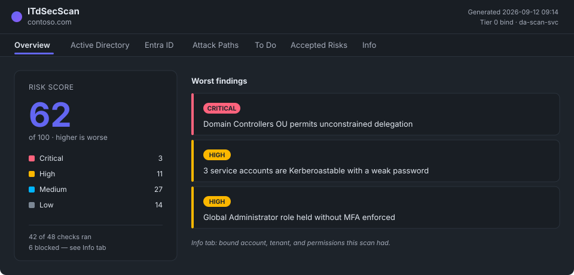

# ITdSecScan

An Active Directory and Entra ID security assessment scanner. One run produces a
self-contained HTML report: every finding, what it means, what to do about it, and
which routes an attacker could take from an ordinary account to control of the
directory.

It is a single executable. No agent, no database, no Go runtime, nothing installed
on a domain controller.

*Illustrative mock-up with invented findings — not a real scan.*

## Start here

| | |
|---|---|
| **[Set up the Entra app](setup/entra-app.md)** | Needed once per tenant, before any Entra check can read anything. |
| **[Set up Active Directory access](setup/active-directory.md)** | Which account to bind as, and what a less privileged one costs you. |
| **[Run a scan](guide/scanning.md)** | The options that matter, baselines, comparisons, several tenants from one installation. |
| **[Read the report](guide/report.md)** | The tabs, the filters, attack paths, and the object inspector. |
| **[Accepted risks and to-dos](guide/accepted-risks-and-todos.md)** | How a decision made in the report reaches the next scan. |

## Reference

| | |
|---|---|
| **[Command line](reference/cli.md)** | Every option, generated from the binary. |
| **[Checks](reference/checks.md)** | Every check with its stable ID and ATT&CK mapping. |
| **[Graph permissions](reference/graph-permissions.md)** | What the Entra checks need and why. |

The three reference pages are generated from the source, so they match the build
they were generated from. They are English only.

## Limitations to know before you read a report

- **The attack-path list is not exhaustive.** Checks cap how many findings they
  report, and the path graph is built from those findings, so a path can be absent
  from the report while existing in the directory. The report marks where a list
  was capped.
- **A check that cannot run reports nothing.** An empty section therefore does not
  by itself mean a clean estate. The **Info** tab records the access the scan had —
  the bound account, the tenant, and which Graph permissions were consented — and
  each blocked check states so in its own section.
- **Some remediations can interrupt services.** Where that is the case, the
  guidance names the audit step that shows what will be affected before you make
  the change. Enforcing LDAP signing, for example, stops clients that cannot sign
  from authenticating, and those clients report no error of their own.

# ITdSecScan

Ein Sicherheits-Scanner für Active Directory und Entra ID. Ein Lauf erzeugt einen
in sich geschlossenen HTML-Report: jeden Fund, was er bedeutet, was dagegen zu tun
ist, und welche Wege ein Angreifer von einem gewöhnlichen Konto bis zur Kontrolle
über das Verzeichnis nehmen könnte.

Es ist eine einzelne ausführbare Datei. Kein Agent, keine Datenbank, keine
Go-Laufzeitumgebung, nichts wird auf einem Domänencontroller installiert.

*Illustratives Mock-up mit erfundenen Funden — kein echter Scan.*

## Hier einsteigen

| | |
|---|---|
| **[Die Entra-App einrichten](setup/entra-app.md)** | Einmal pro Tenant nötig, bevor ein Entra-Check überhaupt etwas lesen kann. |
| **[Active-Directory-Zugriff einrichten](setup/active-directory.md)** | Mit welchem Konto gebunden wird, und was ein schwächer berechtigtes Konto kostet. |
| **[Einen Scan ausführen](guide/scanning.md)** | Die relevanten Optionen, Baselines, Vergleiche, mehrere Mandanten aus einer Installation. |
| **[Den Report lesen](guide/report.md)** | Die Tabs, die Filter, Attack Paths und der Objekt-Inspektor. |
| **[Accepted Risks und To-Dos](guide/accepted-risks-and-todos.md)** | Wie eine im Report getroffene Entscheidung den nächsten Scan erreicht. |

## Referenz

| | |
|---|---|
| **[Kommandozeile](reference/cli.md)** | Jede Option, generiert aus der Binary. |
| **[Checks](reference/checks.md)** | Jeder Check mit seiner stabilen ID und ATT&CK-Zuordnung. |
| **[Graph-Berechtigungen](reference/graph-permissions.md)** | Was die Entra-Checks brauchen und warum. |

Die drei Referenzseiten sind aus dem Quellcode generiert und passen daher immer zu
dem Build, aus dem sie erzeugt wurden. Sie liegen nur auf Englisch vor.

## Einschränkungen, die vor dem Lesen eines Reports wichtig sind

- **Die Attack-Path-Liste ist nicht vollständig.** Checks begrenzen, wie viele
  Funde sie melden, und der Pfad-Graph wird aus genau diesen Funden gebaut — ein
  Pfad kann also im Report fehlen, obwohl er im Verzeichnis existiert. Der Report
  markiert, wo eine Liste gekappt wurde.
- **Ein Check, der nicht laufen kann, meldet nichts.** Ein leerer Abschnitt
  bedeutet also nicht von selbst einen sauberen Bestand. Der **Info**-Tab hält
  fest, welchen Zugriff der Scan hatte — das gebundene Konto, den Tenant und
  welche Graph-Berechtigungen erteilt waren — und jeder blockierte Check sagt das
  in seinem eigenen Abschnitt.
- **Manche Abhilfemaßnahmen können Dienste unterbrechen.** Wo das zutrifft, nennt
  die Anleitung den Audit-Schritt, der vor der Änderung zeigt, was betroffen wäre.
  Das Erzwingen von LDAP-Signing zum Beispiel stoppt Clients, die nicht signieren
  können, bei der Authentifizierung — und diese Clients melden dabei keinen
  eigenen Fehler.

